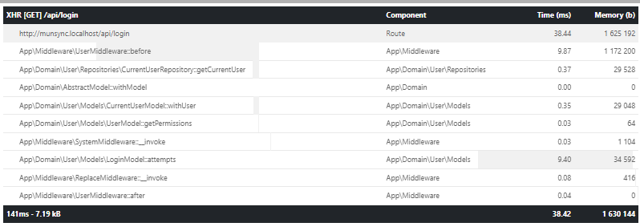

# Hyve Mobile PHP Candidate Project


Subscription options on how to "correctly?" handle subscriptions [click here](words/subscription.md).

Authentication/Authorization please check this [click here](words/authentication.md).

For general notes please check this [click here](words/notes.md).

Eloquent models generation (`/app/Tables`) [click here](words/eloquent_models.md)


## Docker

`cd /to/trash/directory`

`git clone https://github.com/WilliamStam/CandidateProject.git`

`cd CandidateProject`

`docker-compose up` should start the services. (The mysql initialization takes a while tho... please hold)

project should be at http://localhost:8069/ 

## Usage

### OpenAPI

The root of the project should have openapi running. added this in rather quick today so im holding thumbs it works

### Subscription: `/api/subscription?msisdn=xxxxxx&service_id=y`


`GET`: returns the subscription details for the msisdn and service combination

`GET`: without either the msisdn or the service returns a list of subscriptions paginated for the other options. each "option" key can be specified in the query string 

`POST`: creates a subscription record if it doesn't exist (calls "subscription.created" events (hooks), then charges the subscription and calls `subscription.charged` events. This returns the subscription as per above. (i did consider throwing an error if the subscription exists but i really prefer upsert over throwing errors everywhere if i can help it)

`PUT`: if the subscription exists for the combination this is the charge endpoint. it will set the active and charged fields accordingly and then call the  "subscription.charged" event (i don't see the put endpoint being used as much. post does it all.. but spec says 4 endpoints :P )

`DELETE`: this is the cancel endpoint, this sets the active flag to 0 and canceled_at field to the current datetime. then calls the "subscription.canceled" event.

### System Logs: `/api/logs` and `api/logs/x`


## Dev mode

dev mode uses Whoops for the error handler. the docker container includes the default mode which is production (dev = false) so it will hide the error messages and show friendly ones (or not friendly mwhahaha) these are3 controlled in the `/app/Container.php` file. ive added a query string switch if you want to toggle between dev mode and prod mode. very creatively `?dev=1` (or `?dev=you+are+hired`) - anything `dev=...`


### Profiler

use the `?dev=1` option on any of the endpoints and it will include the full profiler as a `PROFILER` key to the json (so when working with the system the profiler is always in your face)

The profiler keeps track of all items added in and how long they took to run and the memory used. In a real app i also calculate offsets n stuff to create a waterfall effect in my front end when displaying the profiler. 



## Errors

ive added an api endpoint for some of the error handlers `/api/errors/{code}`. if the system doesnt know what the error code is it then uses the default. (set in `/app/Container.php`). when in prod mode all the errors are logged to the database (fires an event `error` which then calls event `log`). in dev mode it doesnt log the errors. 

## List Options

most of the lists (logs / subscriptions) have an options key. this is the options passed in to the backend. 

```
"options": {
    "search": null,
    "level": null,
    "page": 1,
    "paginate": 3,
    "order": {
      "id": "desc"
    }
  },
```

These would just be query string params. The order option can be specified as a column|order or a CSV of columns and direction `?order=log|desc,id|desc` 

### Pagination on lists

Passing in a number to `?paginate=x` will paginate to that amount and add in a pagination key with next / previous / info etc. Use `?page=y` to cycle through the pages.

Pagination key returns: (even if you choose `?page=100` it will just default to the last page)
```
"pagination": {
    "page": 1,
    "offset": 0,
    "current": 1,
    "previous": 1,
    "next": 2,
    "last": 4,
    "info": "Page (1 of 4)",
    "records": 10,
    "pages": [
      1,
      2,
      3,
      4
    ]
  }
  ```