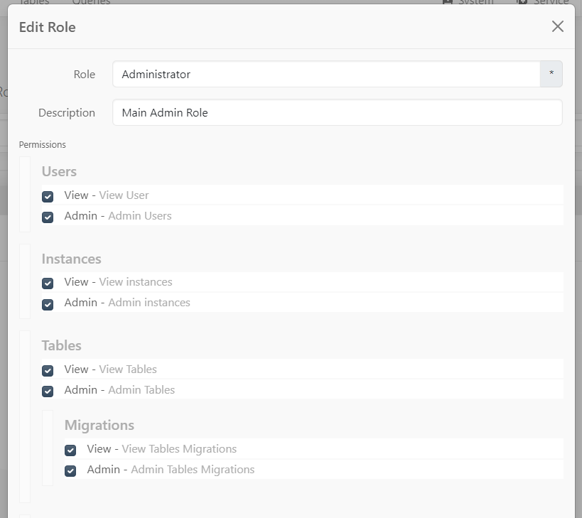

[<- Back](../readme.md)
# Authentication
 
## Database

- `users`
    - `id`: auto incriment
    - `name`: or fullname or whatevers. 
    - `identity`: email / phone / oath (google / twitter etc)
    - `password`: `password_verify()` and `password_hash()` for encrypting and checking
    - `settings`: normaly i would have a settings field, less useful for a straight api but storing stuff like last used instance, last used order for a page etc.
    - `created_at`: eloquent stuff that turns out to be useful
    - `updated_at`
- `tokens` - these get cleared on logout / expired to keep the speed. we can pretty much merge this with the logins table but then not clear it but i found keeping the tokens table lite to only active tokens helped a lot with performance. 
  - `user_id`: links to the users table
  - `token`: a generated token for the session
  - `created_at`: if tokens have a life span etc
  - `last_used`: when the token was last used
- `logins`: - 
  - `user_id`: the user that logged in
  - `token`: the token used
  - `ip`: ip of the user logging in (`$_SERVER['REMOTE_ADDR']`)
  - `proxy_ip`: the forwarded ip, in-case a ton of people from the same network login it will look suspicious if we only look at the ip (`$_SERVER['HTTP_X_FORWARDED_FOR']`)
  - `agent`: the browser string used. would love to say "chrome v100.01" but those arent manageable without constant updates so i would capture the full string and then post process it (`$_SERVER['HTTP_USER_AGENT']`)
  - `created_at`: when the user logged in


## Api

have an auth endpoint `/api/auth/login` that accepts a username / password. this passes the username / password to the auth manager that loops through a set of `providers` like `local`, `ldap` and the first 1 to match a user (using the db / calling a service etc)  returns the user and then generates a token. this token is then returned via the api. 

any subsequent calls to the api must use this token in either the header `Authorization` or the url `?token=` or a session cookie. (i found it easier to use if you make provision on all 3). any time a token option is passed and it doesnt retrieve a user (expired / guessing attack) the token is logged with the ip+proxy+agent for future banning etc. 

the slim application has a middleware that returns the user and sets it as a `$request->withAttribute("USER",$user)` 


# Authorization (RBAC)

## Database

- `roles`: a role here is just a group of permissions
  - `id`: auto increment
  - `label`: a friendly name for the role
- `roles_permissions`: 
  - `role_id`: linking to the role
  - `permission`: the permission the role has. this will be a dot seperated string like `admin.users.add` 
- `users_roles`:
  - `user_id`: links to the user
  - `role_id`: links to the roles - a user can have multiple roles. 

## Api

the user object above has a permissions array with builds up the permissions from the different "roles" the user has. so not "user has role x". its the exact permissions the user has from the roles_permissions table. 

A "permission item" looks like:
```
class AddPermission  extends AbstractPermission {
    public $key = "add";
    public $label = "Add a user";
    public $description = "Add a user to the system";
    public $parent = UsersPermission::class;
}
```
these can be infinite levels deep. for each level it adds the key to the dot notation ie `users.add` if the users permission was a root if not it would build up the permission. 

have a singleton on the app for "permissions". 

have a middleware called `AuthMiddleware` which accepts either parameters of permission items / a single permission item / array of permission items or empty. if empty it just checks if there is a user (authentication) if not throws the 401. if there are permission items included check that the user has the "built up" key for each of them, if not throw a 403. 

just add the auth middleware to any route:
```
$section->group("/roles", function (RouteCollectorProxy $group) {
    $group->get("[/{role_id}]", Controllers\RolesController::class)->add(new AuthMiddleware(Permissions\ViewPermission::class));
    $group->post("[/{role_id}]", [Controllers\RolesController::class,'post'])->add(new AuthMiddleware(Permissions\AdminPermission::class));
    $group->delete("/{role_id}", [Controllers\RolesController::class,'delete'])->add(new AuthMiddleware(Permissions\AdminPermission::class));
})->add(AuthMiddleware::class);
```

the `AuthMiddleware` initialization adds the permission to the permission singleton. so in another api endpoint `/api/roles` it can list all the "active" permissions used and build a tree view for checkbox integration without manually adding them. since these are basic objects performance isnt hit negatively. 



